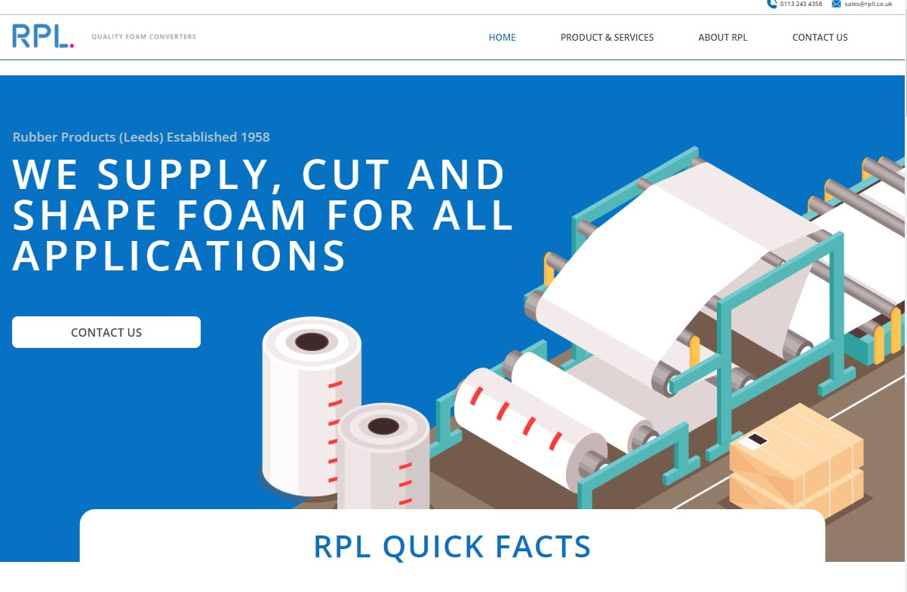
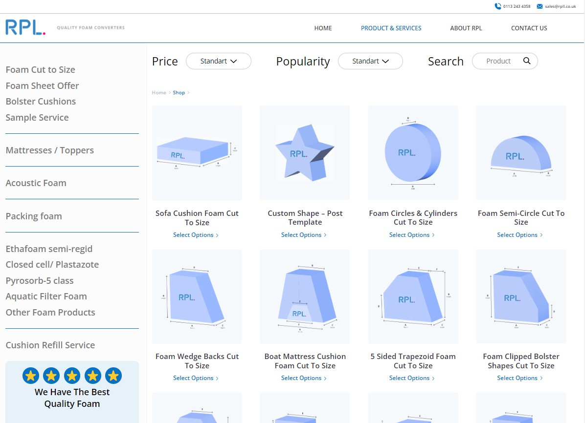
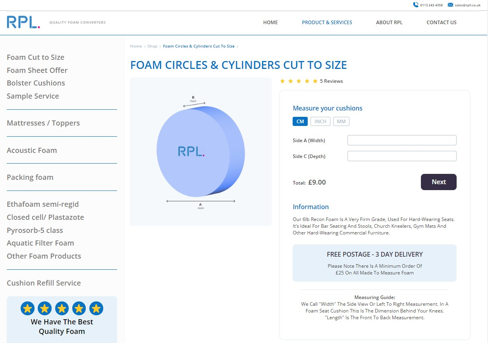
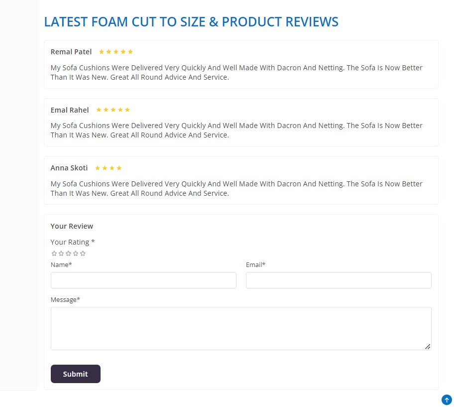

# E-com Foam shop

Welcome to the Foam Store, where you can choose the type of foam you need, from the list of available ones, which covers all possible foam options for you!

## Shop page

In this section, you can choose the best foam for you and your needs.

## Product page

Here you can enter your measurements of your cushion/seats/foam mattresses and whatever else you need so we can custom-make foam products to fit you.

## Feedback form

In this section you can leave a review about our store or the product you like

## Technology stack

React, JS, HTML, CSS

## Installation

To install the application, follow these steps:

Clone the repository to your local machine.
Open a terminal and navigate to the root directory of the project.
Run npm install to install the dependencies.
Run npm start to start the development server.
Open http://localhost:3000 in your browser.
